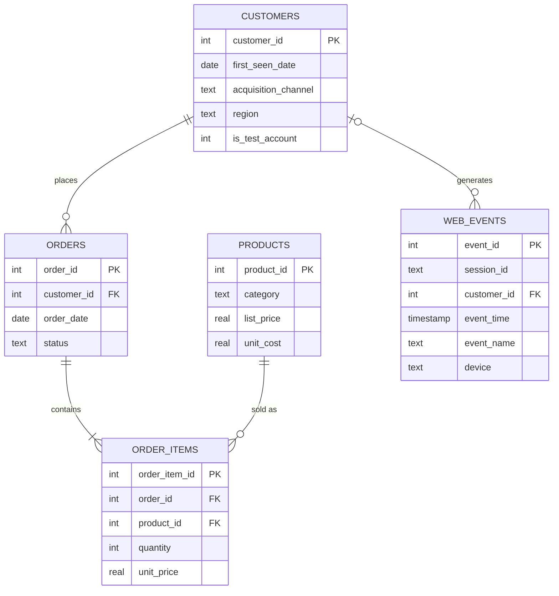
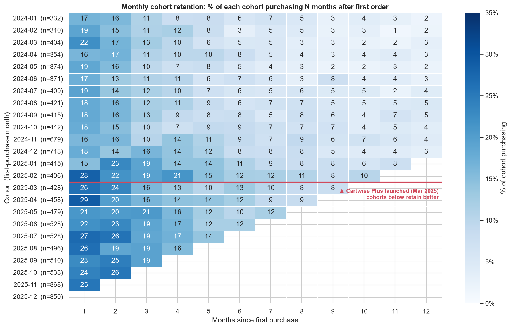
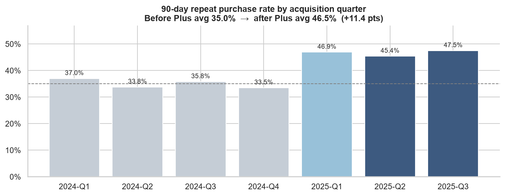
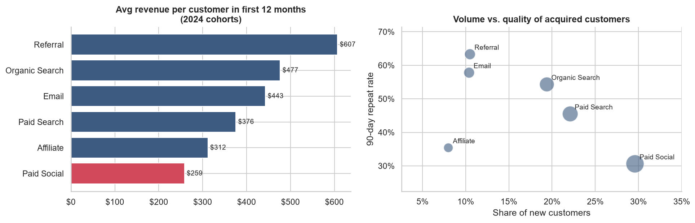
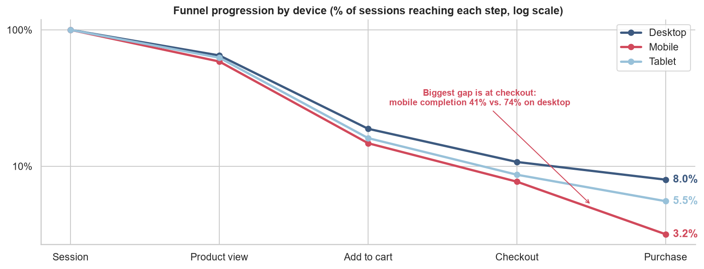
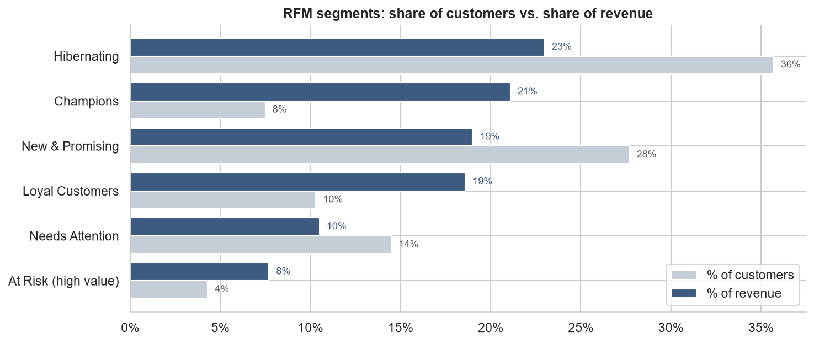
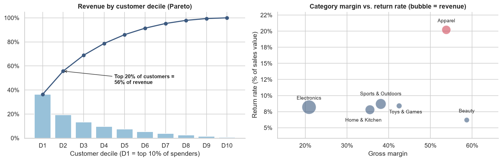

# 🛒 E-commerce Customer Retention & Funnel Analysis (SQL)


> **Revenue doubled, but was the growth healthy?** I used SQL to analyse two years of orders and
> 70,000 web sessions for an online retailer. The analysis found a **~$240K mobile checkout
> leak**, showed that the **largest acquisition channel brings the least valuable customers**,
> and measured an **11-point lift in repeat purchases** after a membership launch.

📓 **[View the analysis notebook →](notebooks/retention_analysis.ipynb)**  ·  🗃️ **[Browse the SQL →](sql/)**

---

## 📌 Business problem

Cartwise, a fictional online store, grew net revenue from **$1.5M (2024) to $3.0M (2025)**, much of it
through paid marketing. Leadership asked:

1. Do new customers come back, and did the **Cartwise Plus** free-shipping membership (launched March 2025) help?
2. Which **acquisition channels** bring customers with the highest long-term value?
3. Where in the **purchase funnel** are we losing shoppers?
4. Who are our **most valuable customers**, and which ones are we at risk of losing?

## 🗄️ Data model



| Table | Rows |
|---|---:|
| customers | 12,000 |
| orders | 24,836 |
| order_items | 49,707 |
| products | 200 |
| web_events | 134,429 |

## 🧰 SQL techniques demonstrated

| Technique | Where |
|---|---|
| Data-quality checks (orphans, nulls, duplicates, outliers) | [`01_data_quality_checks.sql`](sql/01_data_quality_checks.sql) |
| Reusable **views** as a clean semantic layer | [`02_views.sql`](sql/02_views.sql) |
| **Window functions**: `LAG`, `ROW_NUMBER`, `NTILE`, running totals with frames | [`03`](sql/03_kpi_overview.sql), [`04`](sql/04_cohort_retention.sql), [`07`](sql/07_rfm_segmentation.sql), [`08`](sql/08_product_and_concentration.sql) |
| Multi-step **CTEs** and date arithmetic for **cohort analysis** | [`04_cohort_retention.sql`](sql/04_cohort_retention.sql) |
| **Conditional aggregation** to pivot clickstream events into a funnel | [`06_funnel_analysis.sql`](sql/06_funnel_analysis.sql) |
| **RFM segmentation** with business-rule scoring | [`07_rfm_segmentation.sql`](sql/07_rfm_segmentation.sql) |
| What-if **revenue opportunity sizing** | [`06_funnel_analysis.sql`](sql/06_funnel_analysis.sql) |

<details>
<summary><b>Example: cohort retention query</b></summary>

```sql
WITH activity AS (               -- every month in which a customer purchased
    SELECT DISTINCT customer_id, order_month AS activity_month
    FROM v_orders
    WHERE status <> 'Cancelled'
),
cohort_size AS (
    SELECT cohort_month, COUNT(*) AS cohort_customers
    FROM v_customer_summary
    GROUP BY cohort_month
),
retention AS (
    SELECT  s.cohort_month,
            (CAST(strftime('%Y', a.activity_month) AS INTEGER) - CAST(strftime('%Y', s.cohort_month) AS INTEGER)) * 12
          + (CAST(strftime('%m', a.activity_month) AS INTEGER) - CAST(strftime('%m', s.cohort_month) AS INTEGER))
                                                    AS month_number,
            COUNT(DISTINCT a.customer_id)           AS active_customers
    FROM activity a
    JOIN v_customer_summary s ON s.customer_id = a.customer_id
    GROUP BY 1, 2
)
SELECT  r.cohort_month, cs.cohort_customers, r.month_number, r.active_customers,
        ROUND(1.0 * r.active_customers / cs.cohort_customers, 4) AS retention_rate
FROM retention r
JOIN cohort_size cs ON cs.cohort_month = r.cohort_month
ORDER BY r.cohort_month, r.month_number;
```
</details>

<details>
<summary><b>Example: funnel by device with conditional aggregation</b></summary>

```sql
WITH session_steps AS (
    SELECT  session_id, device,
            MAX(event_name = 'session_start')   AS s1_session,
            MAX(event_name = 'product_view')    AS s2_product_view,
            MAX(event_name = 'add_to_cart')     AS s3_add_to_cart,
            MAX(event_name = 'begin_checkout')  AS s4_checkout,
            MAX(event_name = 'purchase')        AS s5_purchase
    FROM v_events
    GROUP BY session_id, device
)
SELECT  device,
        SUM(s1_session) AS sessions,
        ROUND(100.0 * SUM(s5_purchase) / SUM(s4_checkout), 1) AS checkout_completion_pct,
        ROUND(100.0 * SUM(s5_purchase) / SUM(s1_session), 2)  AS session_conversion_pct
FROM session_steps
GROUP BY device;
```
</details>

## 🧹 Data quality: caught before analysis

- **12 internal test accounts** had placed 540 fake orders (45 orders each, against 2 for real customers). They would have inflated loyalty metrics, so they are excluded in every view.
- **0.8% of clickstream events were duplicates** (tracking tag fired twice). These are de-duplicated so funnel counts aren't overstated.
- Referential integrity checks (orphan orders, empty orders, invalid prices) all passed.

## 📊 Key findings

### 1. Cartwise Plus lifted repeat purchases



The 90-day repeat rate rose from **~35% → ~46%** for cohorts acquired after the launch. Comparing Q1 2025 with Q1 2024 (same season) shows the same lift, so seasonality is unlikely to explain it.

### 2. The biggest channel brings the least valuable customers


**Paid Social** brings **30% of new customers** but has the lowest 90-day repeat rate (31%) and 12-month value (**$259**, against **$607** for Referral).

### 3. Mobile checkout is leaking revenue


Mobile and desktop behave similarly until checkout. Then **only 41% of mobile checkouts complete, against 74% on desktop**. Matching desktop would mean **≈1,100 more orders, or ≈$240K per year**.

### 4. Revenue is concentrated, and some valuable customers are slipping away



- The top **20% of customers generate 56% of revenue**.
- **471 "At Risk" customers** (avg. $739 lifetime spend) haven't purchased in about 15 months.
- **Apparel** has a 54% margin but a **20% return rate**, more than double any other category.

## 💡 Recommendations

| # | Recommendation | Expected impact |
|---|---|---|
| 1 | **Fix mobile checkout**: shorter forms, wallet payments, faster page load, then A/B test a one-page checkout | ≈ **$240K** per year |
| 2 | **Shift budget from Paid Social** to Referral, Search and Email; judge channels on 12-month value, not cost per first order | Higher LTV per marketing dollar |
| 3 | **Scale Cartwise Plus**: offer it at first checkout and validate with a holdout group | More repeat orders from customers already acquired |
| 4 | **Win back "At Risk" high-value customers** with a targeted campaign | Recovering 10–15% ≈ **$35–50K** |
| 5 | **Reduce Apparel returns** with size guides and fit reviews | Protect about **$169K** of returned sales |

## 🗂️ Repository structure

```
sql-customer-retention-analysis/
├── sql/                                  # ⭐ all analysis logic lives here
│   ├── 00_schema.sql
│   ├── 01_data_quality_checks.sql
│   ├── 02_views.sql
│   ├── 03_kpi_overview.sql
│   ├── 04_cohort_retention.sql
│   ├── 05_channel_performance.sql
│   ├── 06_funnel_analysis.sql
│   ├── 07_rfm_segmentation.sql
│   └── 08_product_and_concentration.sql
├── data/
│   ├── cartwise.db                       # SQLite database (open with DB Browser / DBeaver)
│   └── csv/                              # same tables as CSV
├── outputs/                              # every query result as CSV
├── notebooks/retention_analysis.ipynb    # runs the SQL and visualises the results
├── src/
│   ├── generate_data.py                  # reproducible synthetic data generator
│   └── sql_runner.py                     # runs named queries from the .sql files
└── images/
```

## ▶️ How to run

```bash
git clone https://github.com/jpuppala1707/sql-customer-retention-analysis.git
cd sql-customer-retention-analysis
pip install -r requirements.txt
python src/generate_data.py      # optional: rebuilds data/cartwise.db
python src/sql_runner.py         # runs every query -> outputs/*.csv
jupyter notebook notebooks/retention_analysis.ipynb
```

You can also open `data/cartwise.db` in [DB Browser for SQLite](https://sqlitebrowser.org/) or DBeaver and run the `.sql` files directly.
The queries use standard SQL and port to PostgreSQL or Snowflake with minor date-function changes.

## 📝 About the data

The data is **synthetic**. It was generated by [`src/generate_data.py`](src/generate_data.py) with realistic
seasonality, channel behaviour, return rates and data-quality issues. The business patterns were built into
the generator, and the SQL analysis was then used to uncover and size them without reference to those settings.

---
**Jatin Kumar Puppala** · Data Analyst · [GitHub](https://github.com/jpuppala1707)
